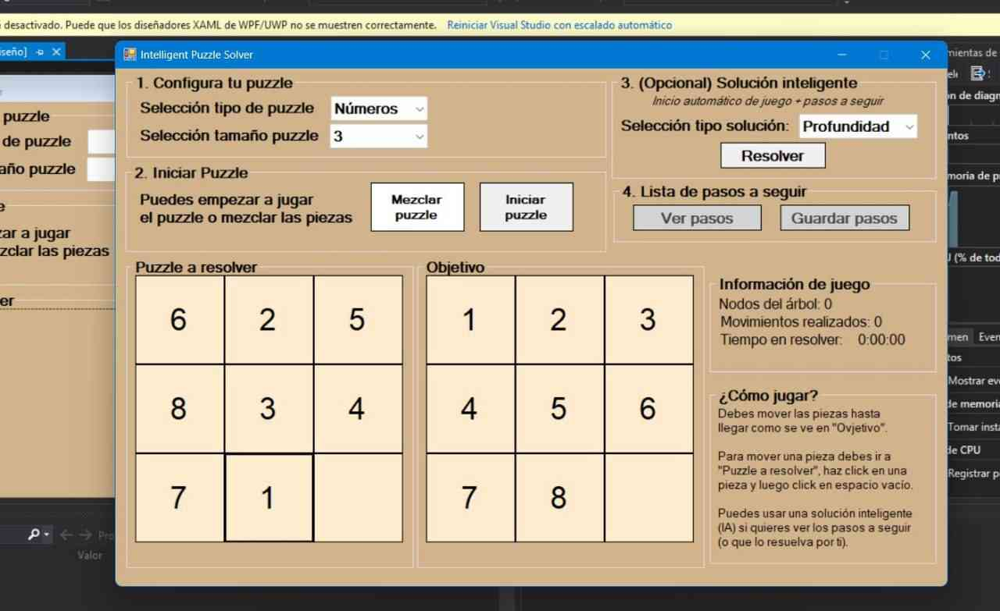
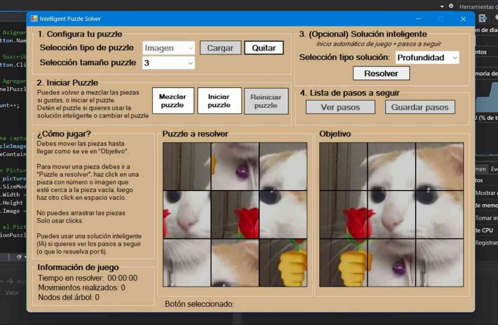

# CIPS Intelligent Puzzle Solver

## 🇬🇧 English Version

### Description

**CIPS Intelligent Puzzle Solver** is a desktop application built with **C#** and **Windows Forms (.NET Framework)** designed to simulate and solve sliding puzzles (N-Puzzle).

The application allows users to play manually or use **Artificial Intelligence algorithms** (such as Breadth-First Search - BFS) to find the optimal solution. It supports both classic numeric puzzles and custom image-based puzzles, offering a visual step-by-step guide to solving them.

### Key Features

* **Dual Game Modes:**
  * **Numeric Puzzle:** Classic grid with ordered numbers.
  * **Image Puzzle:** Upload any image (`.jpg`, `.png`) and the system splits it into puzzle pieces.
* **AI Solver:** Implements search algorithms (BFS/DFS) to solve the puzzle automatically.
* **Step-by-Step Visualization:** Generates a list of specific moves to reach the solution.
* **Customizable Difficulty:** Supports grid sizes from 3x3 up to 9x9.
* **Game Metrics:** Includes a real-time timer and movement counter.
* **State Management:** Capability to pause, restart, and shuffle the board.

### Technologies Used

* **Language:** C#
* **Framework:** .NET Framework 4.6
* **GUI:** Windows Forms (WinForms)
* **IDE:** Visual Studio

### Demo Videos

Watch the application in action:

* 🎥 **Demo 1:** [Watch on YouTube](https://www.youtube.com/watch?v=3OQXaoXlEFI)
* 🎥 **Demo 2:** [Watch on YouTube](https://www.youtube.com/watch?v=108Znr3UGgA)

### Authors & Contributors

* **David Pinto Gómez** - *Lead Developer*
  * [LinkedIn](https://www.google.com/search?q=https://www.linkedin.com/in/pinto-gomez-david/)
  * [GitHub](https://www.google.com/search?q=https://github.com/pintomultimedia2002)
* **PaulaRR2000** - *Collaborator*
  * [GitHub](https://github.com/PaulaRR2000)

---

## 🇪🇸 Versión en Español

### Descripción

**CIPS Intelligent Puzzle Solver** es una aplicación de escritorio desarrollada en **C#** y **Windows Forms (.NET Framework)** diseñada para simular y resolver rompecabezas deslizantes (N-Puzzle).

La aplicación permite a los usuarios jugar manualmente o utilizar algoritmos de **Inteligencia Artificial** (como Búsqueda en Anchura - BFS) para encontrar la solución óptima. Soporta tanto rompecabezas numéricos clásicos como rompecabezas basados en imágenes personalizadas, ofreciendo una guía visual paso a paso para resolverlos.

### Características Principales

* **Dos Modos de Juego:**
  * **Puzzle Numérico:** Cuadrícula clásica con números ordenados.
  * **Puzzle de Imagen:** Carga cualquier imagen (`.jpg`, `.png`) y el sistema la divide en piezas jugables.
* **Solucionador IA:** Implementa algoritmos de búsqueda (BFS/DFS) para resolver el puzzle automáticamente.
* **Visualización Paso a Paso:** Genera una lista de movimientos específicos para llegar a la solución.
* **Dificultad Personalizable:** Soporta tamaños de cuadrícula desde 3x3 hasta 9x9.
* **Métricas de Juego:** Incluye cronómetro en tiempo real y contador de movimientos.
* **Gestión de Estado:** Capacidad para pausar, reiniciar y mezclar el tablero.

### Tecnologías Utilizadas

* **Lenguaje:** C#
* **Framework:** .NET Framework 4.6
* **Interfaz (GUI):** Windows Forms (WinForms)
* **IDE:** Visual Studio

### Videos de Demostración

Mira la aplicación en funcionamiento:

* 🎥 **Demo 1:** [Ver en YouTube](https://www.youtube.com/watch?v=3OQXaoXlEFI)
* 🎥 **Demo 2:** [Ver en YouTube](https://www.youtube.com/watch?v=108Znr3UGgA)

### Autores y Colaboradores

* **David Pinto Gómez** - *Desarrollador Principal*
  * [LinkedIn](https://www.google.com/search?q=https://www.linkedin.com/in/pinto-gomez-david/)
  * [GitHub](https://www.google.com/search?q=https://github.com/pintomultimedia2002)
* **PaulaRR2000** - *Colaboradora*
  * [GitHub](https://github.com/PaulaRR2000)
